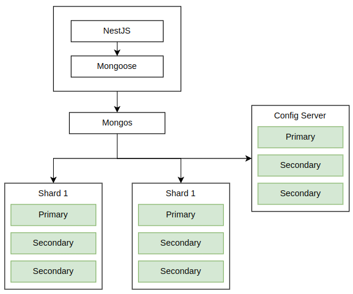

# MongoDB project 2022-23 - Form Block

## Introduction

I chose to implement the form block as it was the most interesting to me
and looked like the most challenging out of the 2 options.

Features:

- Create a form like you would create a text block or header block
- Add fields to the form :
  - Small text field
  - Large text field
  - Integer field
  - Select field
- Order the fields
- Make the form read-only (to allow answers) or read-write (to allow editing)
- Answer the form
- View answers to the form
  - View answers to a specific field (with pagination)
  - View answers one by one (with pagination)
  - View the summary of answers to a specific field

## Technical overview

The form is treated as any other block in a `file`. Hence, the block type
`form` was added. Forms are stored in the `forms` collection. The form
bock then references the form by its id.

The form access level evolves with the `file`'s access level. If the file
is set to `read-only`, users can answer the form but not modify it. If the file is set to `read-write` any user can modify the form and consult
the answers.

Notice how setting the `file` to `read-write` makes the form lose its
purpose. Hence, users should set the form to `read-only` to collect
answers.

This can be fixed with finer access control. Meaning, you can give access
to a `file` to a specific user or group of users. This is not implemented
yet, as it is not in the scope of this project.

### Data model

Considerations for forms:

- A form doesn't need a name or a description, since you can add text blocks and title blocks to the file.
- Each field has a `kind` (type).
- There are 3 similar types of form fields : `tinytext`, `text` and `integer`.
- `select` fields are a special case of `tinytext` fields.
- Each field has a `label` and a `description`.
- Fields can have non required values, hence we need to account for missing values.

The following is the model for the `forms` object, which represents the form itself:

```{json}
{
    owner: ObjectId('users'),
    accessLevel: 'r' | 'w' | 'private',
    fields: [FormField],
}
```

The following is the model for the `formField` object, which represents a field in the `form` (a question):

```{json}
{
    label: string,
    description?: string,
    isRequired: boolean default false,
    kind: 'tinytext' | 'text' | 'integer' | 'select',
    options?: [string], // only for select fields,
    version: number,
}
```

The following is the model for the `answer` object, which represents an answer to a `form`:

```{json}
{
    form: ObjectId('forms'),
    createdAt: Date,
    answers: [FieldAnswer],
}
```

The following is the model for the `fieldAnswer` object, which represents an answer to a `formField`:

```{json}
{
    formField: ObjectId('formFields'),
    value: string | number,
    version: number,
}
```

### Accessing the data

#### Forms

Forms are queries through their id from a block. Actions performed on forms are simple CRUD
operations. In the case of the update operation, instead of updating the whole form, we
update the fields of the form for performance reasons.

#### Answers

We can query for answers with 3 different strategies:

- Query for answers to a specific form
- Query for answers to a specific field
- Summarize answers on a specific field

The first two strategies are simply aggregations for pagination.

The last strategy is a bit more complex. We need to determine the type of the field in order
to summarize the answers. We first query for the form and the field. Then we determine the
aggregate function to use based on the field type. Finally, we aggregate the answers and
return the result.

Tinytext, text and select fields are summarized by counting the occurrences of each answer and
ordering them by the most recurrent. Text fields also have the average word count of the answers.

Integer fields are summarized by calculating the average of the answers, the minimum, the maximum, and the median.

*Note:* You can find the aggregation queries [here](https://gitlab.polytech.umontpellier.fr/polynotes-mmdj/back/-/blob/forms/src/forms/answers/answers.service.ts)

### Validation

Validation is done in the backend using mongoose. We could also validate the data in the
collection using schema validation. However, since this is a prototype, we want to be able
to change the schema easily.

### Indexes

No indexes are needed for the `forms` collection as we do not query for
forms with any criteria other than the id.

The `answers` collection is indexed on the `form` field as we query for
answers to a specific form.

Each individual answer also has a composite index on the `formField` and
`version` fields. This is used in aggregation queries and find queries.

### Advatages and disadvantages

#### Forms and Answers collections relationship

Forms and fields are stored in a single collection. This makes it easy to
query for forms and fields. We could expect answers to be stored in the
same collection. However, this would make an individual form document
very large and cause performance issues and limit the number of answers.

It can also compromise scalability. Indeed, in the case the application
is used by numerous users, we might want to shard the
collection. However, collections with large documents can cause uneven
distribution of data across shards, jumbo chunks and other issues.

Hence, we store answers in a separate collection. This allows us to
easily query for answers and to shard the collection if needed.

#### Answers collections

Answers reference the form they are answering and hold an array of
answer to each field. Grouping answers by form makes it easier to query
and insert answers.

However, it reduces performance when querying for answers to a specific
field. Indeed, we need to query for all answers to a form and then
iterate over the answers to find the answer to the field we are looking
for.

#### Relationship between form fields and answers and missing values

Each form field has a unique id and a version number. This is used to
reference the field in the answers. Having a unique id for each field
allows us to make sure the answer is answering the right field.

The version number is changed each time a breaking change occurs to the
field (for example, changing the `kind` of a field from `text` to `integer`).
Hence, when the version number changes, the answer is no longer valid but
the answers to other fields are still valid.

We could delete the specific when a breaking change occurs. However, this
might cause inconsistencies in the data, or it might be too costly in terms
of performance.

### Scalability

In order to make sure the database can handle numerous users, we need to make sure
it is scalable. Obviously, we will go for horizontal scaling as it is more cost-effective.

I decided to shard the answers collection. Why the answers collection? Because it is the
collection that will grow the most. Indeed, a form will most likely be answered by multiple
users. Hence, the answers collection will grow faster than the forms collection. In the
future, we might want to shard the forms collection as well.

When picking a shard key, we need to choose a field with high cardinality, low frequency
and non-monotonically changing. In our case, we do not have such a field. Compound shard
key also is not an option. Hence, we will use a hashed shard key. This will distribute
the data evenly across shards, but will not allow us to query for answers to a specific
form or field, which can impact performance.

## Installation

### Topology

In a goal to simulate a production environment, which means having
a scalable and highly available database (to a certain extent), I
decided to use replica sets to duplicate the data across multiple
nodes and to shard the answers collection.

Since I do not have access to multiple machines, I used VMs to simulate
the different nodes. Here is the cluster's topology:



The cluster consists of 2 shards, 1 config server and 1 mongos. Each
shard is a replica set of 3 nodes. The config server is a replica set
of 3 nodes. There is only 1 mongos. You can add more mongos to the
cluster to make it more available.

More shards can be added to the cluster to increase the capacity of the
cluster.

I used 3 nodes for each replica set to avoid election issues. Indeed,
if there are only 2 nodes in a replica set, if one node goes down, the
other node cannot elect itself as primary. Hence, the replica set is
unavailable until the node comes back up.

### Requirements

All the files needed to set up the cluster are in
[this](https://gitlab.polytech.umontpellier.fr/polynotes-mmdj/back/) repository.

- Git
- Vagrant
- Libvirt, VirtualBox or another provider supported by Vagrant
- Ansible

### Setup

Boot up the vms :

```{}
git clone git@gitlab.polytech.umontpellier.fr:polynotes-mmdj/back.git
cd back
git checkout forms
cd mongodb
vagrant up
```

Install mongodb and add the configuration files :

```{}
ansible-playbook playbook.yml --ask-vault-pass
```

*Notes:*

- The playbook will ask for a password to decrypt the vault. The
password is `<see password given in form>` by default. (You might want to change the secret in
the vault if you want to use it in production).
- The pki is the same for all the nodes. This is not a good practice but
since this is not a production environment, I decided to use the same
pki for all the nodes to simplify the setup.

Add the user to the admin database in the mongos (localhost privilege won't work if you don't
ssh into the node) :

```{}
vagrant ssh mongos

mongosh

use admin

db.createUser({ user: 'admin', pwd: 'admin', roles: [ 'root' ]}) # You can come up with a more secure password
```

*Notes:*

- Creating a user with root privileges is not a good practive. However,
since this is not a production environment, I decided to use a user with
root privileges to simplify the setup.
- In a production environment, you would want to create a user with
`clusterAdmin` privileges instead of `root` privileges.

Add the shards to the cluster (still in the mongos):

```{}
db.auth('admin', 'passsword') # Authenticate as the admin user

sh.status() # Check that the config server is connected
> ...
databases
[
  {
    database: { _id: 'config', primary: 'config', partitioned: true },
    collections: {}
  }
]

sh.addShard('rsdo-sh1/192.168.121.3')

sh.addShard('rsdo-sh2/192.168.121.6')

sh.status() # Check the status of the cluster, all the shards should be connected
> ...
shards
[
  {
    _id: 'rsdo-sh1',
    host: 'rsdo-sh1/192.168.121.3:27017,192.168.121.4:27017,192.168.121.5:27017',
    state: 1,
    topologyTime: Timestamp({ t: 1682877846, i: 2 })
  },
  {
    _id: 'rsdo-sh2',
    host: 'rsdo-sh2/192.168.121.6:27017,192.168.121.7:27017,192.168.121.8:27017',
    state: 1,
    topologyTime: Timestamp({ t: 1682877851, i: 1 })
  }
]
...
```

Now that the cluster is setup, you can connect to the mongos and create
the database and the collections :

```{}
use polynotes

db.createCollection('forms')

db.createCollection('formanswers')
db.formanswers.createIndex({ form: 1 })
db.formanswers.createIndex({ 'answers.version': 1, 'answers.formField': 1 })

db.createCollection('users')

db.createCollection('files')

db.createCollection('databases')
```

Setup shard key :

```{}
sh.enableSharding('polynotes')

db.formanswers.createIndex({ createdAt: "hashed" })

sh.shardCollection("polynotes.formanswers", { createdAt: "hashed"})

# check that the collection is sharded
sh.getShardedDataDistribution()
>
{
ns: 'polynotes.formanswers',
shards: [
    {
    shardName: 'rsdo-sh2',
    numOrphanedDocs: 0,
    numOwnedDocuments: 0,
    ownedSizeBytes: null,
    orphanedSizeBytes: null
    },
    {
    shardName: 'rsdo-sh1',
    numOrphanedDocs: 0,
    numOwnedDocuments: 0,
    ownedSizeBytes: null,
    orphanedSizeBytes: null
    }
  ]
}
```

You can now add the sample data from this directory
[here](https://gitlab.polytech.umontpellier.fr/polynotes-mmdj/back/-/tree/forms/mongodb/data) :

```{}
mongoimport --db=polynotes --collection=forms -u admin -p admin --host host --port 27018 --authenticationDatabase admin --file=/path/to/forms.json

mongoimport --db=polynotes --collection=formanswers -u admin -p admin --host host --port 27018 --authenticationDatabase admin --file=/path/to/formanswers.json

mongoimport --db=polynotes --collection=users -u admin -p admin --host host --port 27018 --authenticationDatabase admin --file=/path/to/users.json

mongoimport --db=polynotes --collection=files -u admin -p admin --host host --port 27018 --authenticationDatabase admin --file=/path/to/files.json
```

Once the data is imported, you can check that the data is distributed
evenly across shards :

```{}
use polynotes

db.formanswers.getShardDistribution()
```

You can then launch the backend :

```{}
cd .. # Go back to the root of the project

# fill the .env file with the correct values (see .env.example)

npm install

npm run start:dev
```

And finally the front end :

```{}
git clone git@gitlab.polytech.umontpellier.fr:polynotes-mmdj/front.git

cd front

npm install

npm run dev
```

You can them access the application and login with the following
credentials :

- email: `lapin.malin@carotte.fr`
- password: `<password provided in the form>`

You can then access the form in the only file available in the
home page.

## Post-mortem

### What went well

- Thanks to the courses, I was able to setup a cluster with replica sets
and sharding very easily.
- Aggregation pipelines are very powerful and allow us to do complex
queries. But they are not very intuitive and tend to be very verbose.
- The data is distributed evenly across shards.

### What went wrong

- I had to work with the technical debt of the previous project. I could
have made the `form` and `formanswer` into a special kind of database which
would make the code cleaner and more maintainable but since I was not
satisfied with the way I managed databases in the previous project, I
decided to keep this structure
- The ansible playbook is not idempotent at all. It shouldn't break
anything but it will reconfigure some parts everytime you run it.
- The data is distributed evenly across shards but it is not possible to
leverage targeted queries

### What I learned

- Stop thinking in terms of tables and start thinking in terms of
documents
- How to setup a mongodb cluster
- How to shard a collection
- How to use aggregation pipelines
- How to use indexes and their importance
