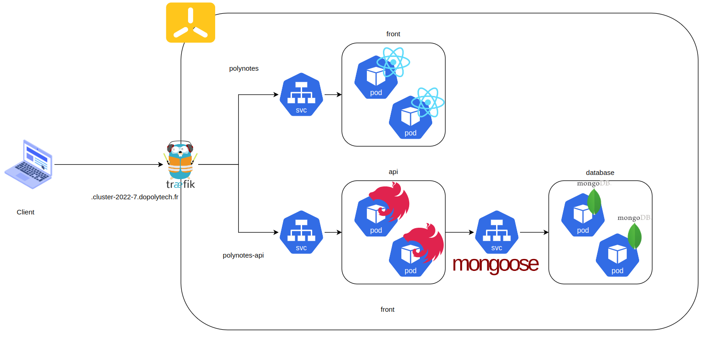
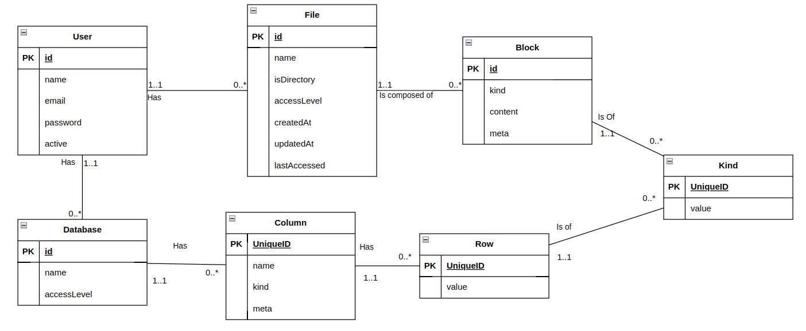
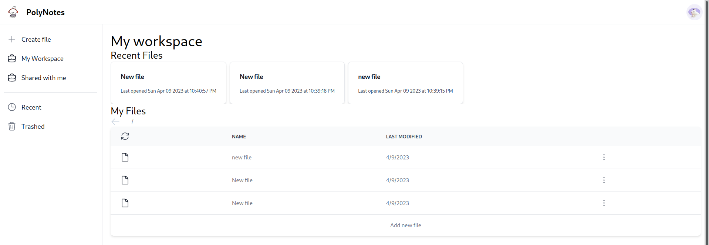
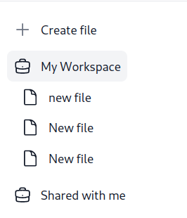
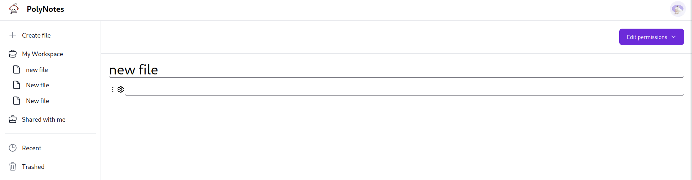
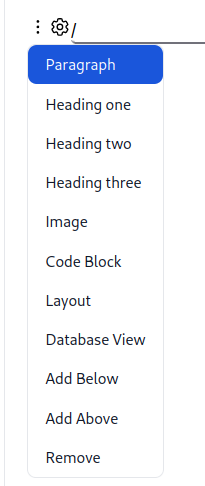
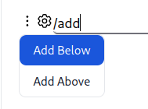
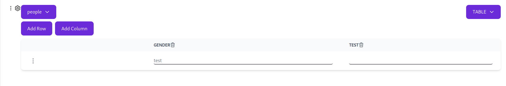
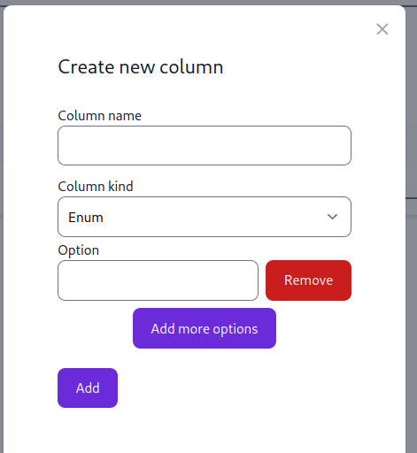
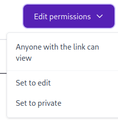

# Polynotes Iteration One TAD

- [Architectural Design](#architectural-design)
- [Technology Stack](#technology-stack)
  - [NestJS](#nestjs)
  - [MongoDB](#mongodb)
  - [ReactJS with Typescript](#reactjs-with-typescript)
  - [Services Architecture](#services-architecture)
  - [Deployment](#deployment)
  - [CI/CD](#ci-cd)
  - [Data Architecture](#data-architecture)
    - [Users Collection Document](#users-collection-document)
    - [Files Collection Document](#files-collection-document)
    - [Database Collection Document](#database-collection-document)
  - [Security](#security)
- [Post-mortem](#post-mortem)
  - [My Experience](#my-experience)
  - [How I would have done it differently](#how-i-would-have-done-it-differently)
  - [Opinion on Technologies](#opinion-on-technologies)
    - [Opinion on MongoDB](#opinion-on-mongodb)
    - [Opinion on ReactJS](#opinion-on-reactjs)
  - [Next Iteration](#next-iteration)
    - [Data](#data)
    - [Testing](#testing)
- [User Manual](#user-manual)
  - [Connecting](#connecting)
  - [Files](#files)
  - [Block Editor](#block-editor)
  - [Database Block](#database-block)
  - [Sharing files](#sharing-files)

## Architectural Design

The app follows a SOFEA approach in order to separate frontend and backend which allows better flexibility,
scalability and maintainability. Hence, the following technology stack choice.

## Technology Stack

Here will be listed each technology choice and why I have chosen them.

### NestJS

For the API framework, I have chosen [NestJS](https://nestjs.com/).

NestJS is built on top of Node.js which is a popular runtime which has a non-blocking I/O model
allowing it to handle a lot of concurrent requests. It is also a runtime which is very easy to
learn and use.

Its popularity is also a good sign that it will be maintained for a long time and that it will
be easy to find help if needed.

NestJS is a framework which is built on top of Express.js which is a popular web framework for Node.js.
Similar to Node.js, Express.js is also very easy to learn and use. And it is also very popular.

Finally, NestJS is built on top of TypeScript which is a superset of JavaScript which adds static
typing. This allows for better code quality and less bugs.

For connecting to the database, I have chosen [Mongoose](https://mongoosejs.com/). Which is an
Object Data Modeling (ODM) library for MongoDB. It is very popular and well maintained.

However, its start up time is a bit slow because of its modular design. This might be a problem
in the future if the app grows. The framework also lacks the ability for fine-grained control.

Overall, It's a good framework to create RESTful APIs.

### MongoDB

For the database, I have chosen [MongoDB](https://www.mongodb.com/). MongoDB is a document-based
database. The fact that it is a document-based database allows for a lot of flexibility in the data
model. Considering the fact that I had little idea of what the data model would look like at the
beginning, it was very helpful to be able to change the data model as I went along.

### ReactJS with Typescript

Ignoring the fact that ReactJS was a requirement, it is a very popular frontend framework. This is
an advantage because it means that there is a lot of documentation and available libraries for it.

In that sense, I used a component library called [Flowbite](https://flowbite.com/). It allowed me
to quickly build the UI without having to worry about the styling.

For the text blocks, I used a library called [TipTap](https://tiptap.dev/). It is a rich text editor
framework for ReactJS and VueJS. It is customizable and allows for a lot of flexibility. I chose to
use it after trying out a few other libraries such as [DraftJS](https://draftjs.org/), [SlateJS](https://www.slatejs.org/) and a few others. I also tried to build my own editor. However, found that
it was too much work for the time I had and the DOM events were not easy to work with.

I used typescript which is a superset of JavaScript which adds static typing. This allows for better
code quality and fewer bugs.

For generating and building the app, I used [Vite](https://vitejs.dev/). It is a build tool which
is fast and is gaining popularity.

### Services Architecture

The app is split into three services:

- API
- Frontend
- Database

The API service is responsible for handling the requests from the frontend and communicating with
the database. It is also responsible for authentication and authorization. It follows a RESTful
approach and is a Monolithic application.

The Frontend service is responsible for handling the requests from the user and displaying the
information to the user. It is also responsible for handling the user input and sending it to the
API service. It is a Single Page Application (SPA).

The Database service is responsible for storing the data. It is a NoSQL database. It is queried
through the API service.

### Deployment

The app is deployed on the servers provided by Polytech. I used [k3s](https://k3s.io/), which is a
lightweight Kubernetes distribution. That way, my scripts are portable and my deployments are
highly available to a certain extent. It is also easy to install and use.

I used traefik as an ingress controller and mapped the domains to the services. I also used
cert-manager to generate and renew the TLS certificates.

I also deployed a MongoDB replica set on the cluster. It is a 2 node replica set.



### CI/CD

I used [GitLab CI](https://docs.gitlab.com/ee/ci/) to automate the deployment of the app. I
configured it to run on every push to the master branch. It runs the tests and builds the app.
Then it deploys the app to the cluster.

### Data Architecture

Based on the requirements, here is the model I came up with:



Note :

- A cell is the combination of a column and a row
- Kind describes the type of a block or of a cell
- A row and a block could be the same entity but I separated them for easier implementation

And here's how I organized it in collections:

#### Users Collection Document

```{json}
// Users collection
{
    _id: ObjectId,
    name: String,
    email: String,
    password: String,
    active: Boolean,
}
```

Users are stored in the users collection. The password is hashed using argon2.

#### Files Collection Document

```{json}
{
    _id: ObjectId,
    name: String,
    owner: ObjectId,
    userId: ObjectId,
    accessLevel: String,
    blocks: [
        {
            _id: ObjectId,
            kind: String,
            content: String,
            meta: Object,
        },
        ...
    ]
}
```

As described in the document, the blocks are nested in the file document. This is because the
blocks are not used anywhere else. They are only used in the context of a file and should be accessed only via the files. It helps for ABAC validation.

It is connected to the users collection through the ```userId``` field. It helps for ABAC validation and for the user to know which files they own.

Access level is a string which can be either ```none``` for private files, ```r``` to allow anonymous
users to read the file and ```w``` to allow anonymous users to read and write to the file.

#### Database Collection Document

```{json}
{
    _id: ObjectId,
    name: String,
    userId: ObjectId,
    accessLevel: String,
    columns: [
        {
            name: String,
            kind: String,
            meta: Object
        },
        ...
    ],
    rows: [
        {
            key: String,
            [columnName]: Object | String | Number | Boolean | Date,
        },
        ...
    ],
}
```

Since the database entity is accessed all at once and that the columns and rows are not used anywhere else, they are nested in the database document. The rows are stored as an array of objects.

The rows have a ```key``` which is an arbitrary value used to identify the row and is served by the front-end.

The columns are stored as an array of objects. The ```name``` field is the name of the column and the kind is the type of the column. The meta field is used to store additional information about the column, such as
in the different values of an enumeration.

Just like the files, the database is connected to the users collection through the ```userId``` field. It helps for ABAC validation and for the user to know which databases they own. The ```accessLevel``` field is the same as the one in the files collection.

Ideally, the access level of the database should be updated based on the access level of the files
using it. However, I did not have time to implement this feature. Hence, the databases can't be
public and anonymouse users can't see / edit them.

### Security

For authentication, I used [JWTs](https://jwt.io/). Their statelessness makes them proper for
cloud native application.

Since I dont need the authenticated user to read the JWT, the JWT is passed in a cookie. This
makes it easier to use in the frontend and prevents XSS attacks.

For authorization, I used [ABAC](https://en.wikipedia.org/wiki/Attribute-based_access_control).
Since all users have the same permissions, I used the attributes on the documents to determine
what the user can do. For example, if the user is the owner of the file, they can edit it, if
the file is readable by anonymous users, they can read it, etc.

During the first connection the user is asked to create a name, a password and an email. Before
they can use the app, they have to confirm their email. This is done by sending them a link to
the email they provided. The link contains a JWT which is used to confirm the email and is passed
in the authorization header.

## Post-mortem

### My Experience

The start-up was very hard since I tried to implement my own rich-text editor. I should have
tried to look for an existing one from the beginning.

In that sense, I also had to try to implement the block editor with a lot of different
rich text libraries. I ended up losing a lot of time on this.

ReactJS was the hardest to deal with. I had a hard time understanding how the state management
worked and it shows in the code. I sort of understand how it works now, however the code is
still a mess.

I also broke a lot of features while trying to implement others. Maybe I did not separate the
components enough.

My CI/CD pipeline also stopped working at some point, I couldn't fix it. The build was failing
because it took too long. I had to manually build and deploy the app.

### How I would have done it differently

I should have spent more time on learning ReactJS and the state management.

### Opinion on Technologies

In this section, I will go over relevant my opinion on the technologies I used.

#### Opinion on MongoDB

Sadly I did not have time to use its full potential. There's no validation, indexes or triggers.

I also had a hard time with the concept of "data that is accessed together should be stored
together". It was hard to move from a relational point of view to a document oriented one.

#### Opinion on ReactJS

Apart from the support from the community and the large ecosystem, I think ReactJS is awful.
Forms are as hard to implement as in VanillaJS and the state management is a mess. I should
not have to worry about the state of my components and implement ```useEffets``` (which tend to get messy with many dependencies), ```useCallbacks``` and ```useMemo```. ReactJS should deal with rerenders. Nested
components are also hard to work with in that sense.

It is also very verbose and requires a lot of boilerplate code.

Contexts are useful but they get invasive when you have to provide multiple contexts in a component.

Technically, ReactJS is not a framework, and it has a lot of rules to follow and once you start
to understand how it works you can do a lot of things. However, I think it is not worth it.

I had a hard time learning it and I would never use ReactJS again if I had a choice.

### Next Iteration

#### Data

The first thing I think we should address is how to store the data.

My opinion is that we should use relational database. The idea came to me at the end of the project. The issue with mongoDB is that it is not good at handling updates. It is better at handling inserts
and deletes. So if I had to update a cell, I would have to update every block that is in that cell or
a block. This would be very slow and would not scale well.

To counter this, I simply send all the blocks of the file to the API. The API then replaces the old
blocks with the new ones. This is not ideal because when the file gets bigger, the network
bandwidth will be a bottleneck.

[Notion](https://www.notion.so/) is a very similar app to mine. They use a relational database
and have overall decent performance (except for collaboration but I don't think it's related to
the database). They have very interesting topics on their [blog](https://www.notion.so/en-us/blog/topic/tech).

#### Testing

I think we should implement tests for both the frontend and the backend to avoid regressions.
Luckily, NestJS and ReactJS have good testing frameworks.

## User Manual

### Connecting

To connect to the app, you need to create an account. Simply follow the instructions on the
website.

### Files

Once you are created, you should see a table with the files you have. If you just created your
account. It should be empty. Simply click on the *Add new file* button to create a new file.



The file explorer works just like the one on your computer.

Files can also be seen on the left side of the screen. You can expand the section *My Workspace* to
view them.



Once ready, you can click on the file to open it. You should see the block editor.

### Block Editor

The block editor is the main feature of the app. At first it should contain only one regular block
and one title block, which is the name of the file. You can edit that first block to change the
file's name.



Each following block is a regular block. You can edit its content by selecting it and typing.
To delete a block, simply select it and press backspace, if it is empty, it will be deleted. To
create one, you can press ```Shift + Enter```.

You will also notice that on the left side of each regular block is a cog. Clicking on it will bring up a context menu which allows you to change the type of the block, delete it or create new blocks above and below it.


You can also access the context menu by typing '/' in a block. It will only work if the block is
empty. You will be able to navigate the menu using arrow keys and select an option by pressing
```Enter```.



You can even type the name of the action you want to perform.



Note that changing the type of a block will delete its content.

You can navigate between blocks using arrow keys or by pressing ```Tab``` and ```Shift + Tab```.

You can also drag blocks around to reorder them by grabbing the handle on the left side of the block.

### Database Block

The database block is a block that allows you to create a table and view its content in different
manners, for now, only the table view is implemented. To create a database block, simply click on
the cog of a regular block and select *Database* (or do it through the slash commands).



You will be able to select a database to use or create one. You will also be able to select how
you want to view the data. After that, you will be able to add columns and rows to the table.



### Sharing files

You can share your file with others by opening the dropdown menu on the top right of the screen.

You can choose to share the file with read-only access or with read-write access. You can also
set it back to private.


